# ⏰ 모여람 (Moyeo-larm)
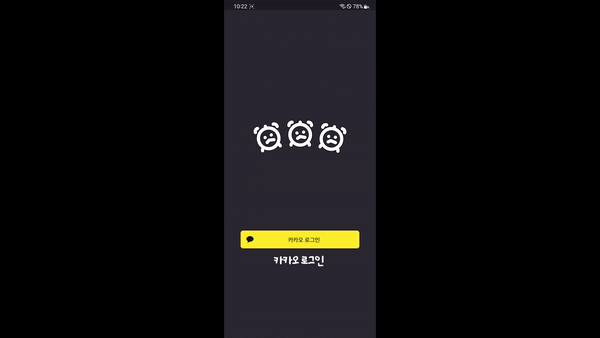
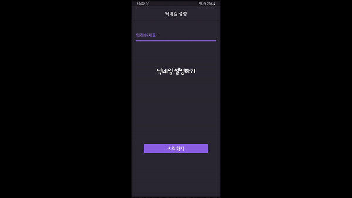
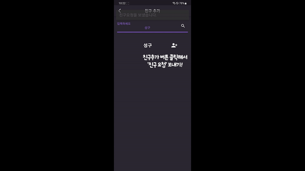
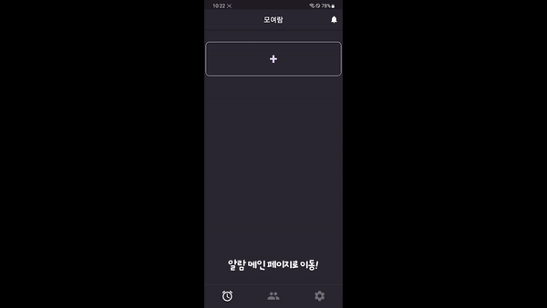
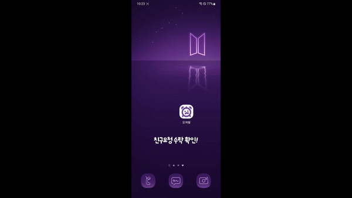
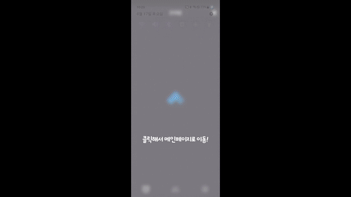
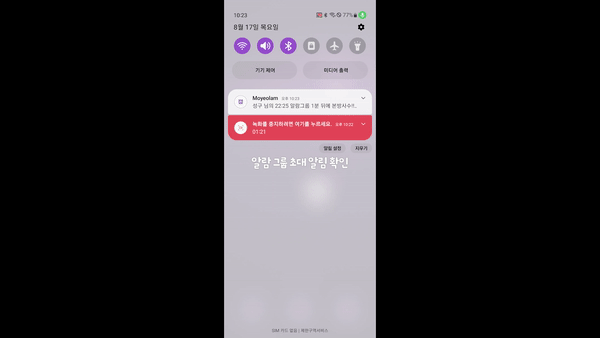
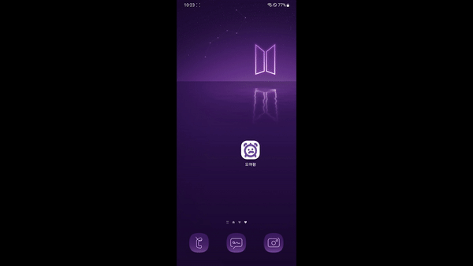
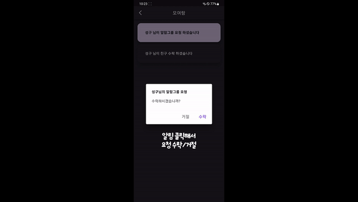
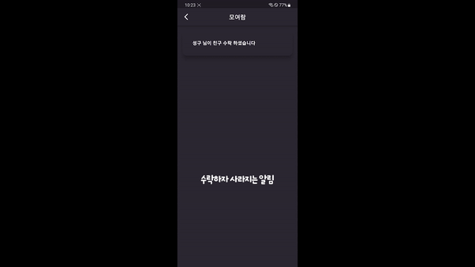
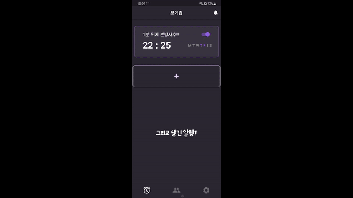

  
# 🔎 서비스 소개 [Introduction]
#### `모여람`은 공유알람 어플리케이션 입니다.
#### 사용자간 협력을 통한 알람공유와 알람해제로 새롭고 효과적인 소셜 알람 서비스입니다. 

  
# 😃 멤버 Members

|Frontend|Frontend|Frontend|Backend|Backend|Backend|
|:---------:|:-------:|:---------:|:------:|:-----:|:------:|
|||||||
|[강성구](링크)|[임서희](링크)|[최휘빈](링크)|[이용준](링크)|[탁성건](링크)|[허재](링크)|

  

# 🔧 기술스택 Tech Stack
## Frontend

 

## Backend
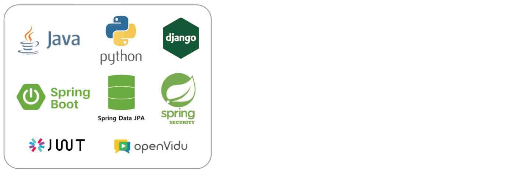
 

## Infra
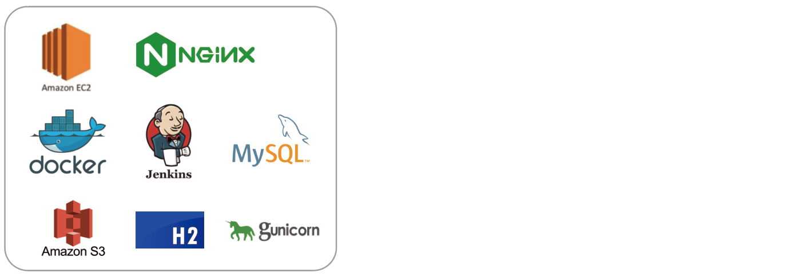

 

  

# 📌 핵심 기능 Core Features
### [API명세서](https://www.notion.so/API-0623a137b9754447ad10bac192d0091e?p=03b2862d655d4bc3966c76619f6d1612&pm=s)
 
 
### ⭐ 카카오 소셜 로그인으로 보다 간편한 회원가입, 로그인
KAKAO OAUTH 를 이용한 소셜로그인 및 jwt 토큰 발급
스프링 시큐리티 AuthenticationFilter를 이용한 토큰 유효성 검증 및 인가 처리 

### ⭐ Web RTC 화상 기술과 얼굴인식 AI 기술
기존의 알람 기능을 보완하기 위해  Web RTC 화상 기술과 얼굴인식 AI 기술로 완성한 얼굴 인식 공유알람을 통해 기존과 다른 알람 서비스 구현 

### ⭐ 파이어베이스 FCM을 활용한 타겟팅 알림 메세지
Google Play 서비스를 사용하는 Android 기기를 사용해 앱 전용 푸시 알림 서비스를 사용자에게 전달. 요청 종류에 따라 사용자가 요청을 보다 쉽게 처리할 수 있도록 메세지 타겟팅

   
# 📏 프로젝트 아키텍처 Project Architecture

## Infrastructure
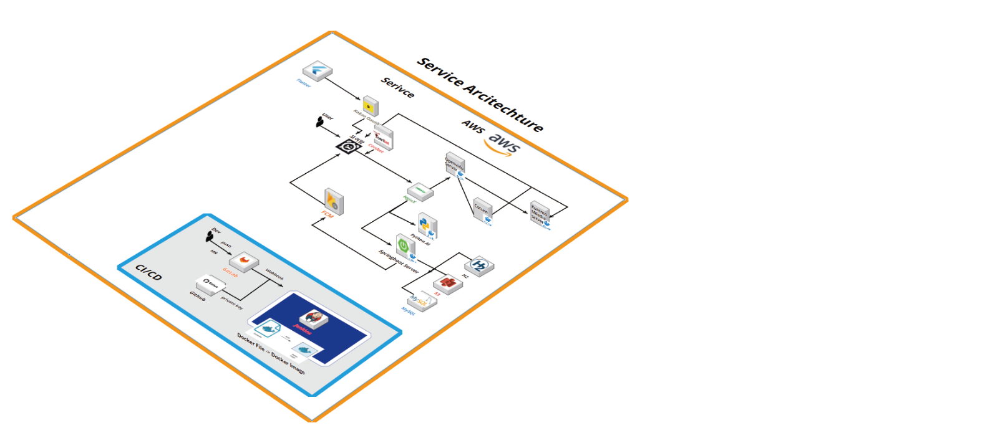

  
# 👫 우리가 일하는 방식 The way we work together
### 1. 적극적으로 소통하기
### 2. 의견을 말할 때는 근거와 함께
### 3. 출근 후, 퇴근 전 진행상황 공유하기
### 4. 결정은 다 같이, 책임도 다 같이

